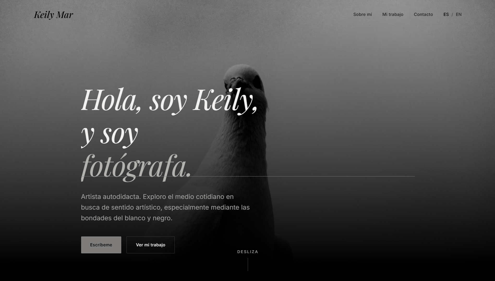

<p align="center">
  
</p>

<h1 align="center">Keily Mar Couselo — Photography Portfolio</h1>

<p align="center">
  <a href="https://astro.build"></a>
  <a href="https://www.typescriptlang.org/"></a>
  <a href="https://tailwindcss.com"></a>
  <a href="https://playwright.dev"></a>
  <a href="https://prettier.io"></a>
  <a href="https://sharp.pixelplumbing.com"></a>
  
  
</p>

Personal website of **Keily Mar Couselo**, a self-taught photographer based in Holguín, Cuba. A bilingual portfolio (Spanish by default, full English translation) that presents her photographic work —predominantly black and white, with a deliberate selection of cold-tone colour— and offers a direct contact path.

---

## What's on the site

- **Landing (`/`)** — Full-viewport hero with one of her photographs, a short introduction, a selection of six featured photos, and a contact form.
- **About (`/sobre-mi`)** — Full biography, portrait, a secondary image, and a facts list (base, working since, subjects, languages, equipment).
- **My Work (`/mi-trabajo`)** — Full masonry gallery with tone filters: *Todas · Blanco y negro · Color*. Each photo opens in an accessible lightbox.
- **404** — Styled error page, bilingual.

All visible copy is in Spanish and English, with no hard-coded strings in components. Spanish is the source of truth and lives at the root (`/`, `/sobre-mi`, `/mi-trabajo`); English is served under `/en` (`/en`, `/en/about`, `/en/my-work`).

## Design decisions

- Achromatic palette: pure black background, layered neutral greys, *gris mustang* `#7E7D7B` accent (chosen by Keily) for rules, underlines, and active states. Hierarchy is carried by brightness, not colour.
- The only chromatic values are the desaturated red (form errors) and green (form success), always paired with text and an icon.
- Typography: **Inter** for body, **Playfair Display Italic** for headings and accents. Only italic Playfair weights are shipped.
- Dark-only theme, by design.
- Photographs are never rounded, never cropped in the gallery, and never colour-graded by the UI.
- Motion is expressive but gated by `prefers-reduced-motion`.

## Tech stack

| Layer | Tool |
|---|---|
| Framework | [Astro 5](https://astro.build) — `output: 'static'` |
| Language | Strict TypeScript |
| Styling | Tailwind CSS v4 (via `@tailwindcss/vite`) |
| Fonts | Fontsource (self-hosted, no Google Fonts requests) |
| Images | `astro:assets` + Sharp (build-time AVIF/WebP) |
| UI framework | **None** — no React/Vue/Svelte. Interactivity is plain TypeScript in `<script>` blocks |
| Tests | `node:test` (unit + built output) + Playwright + axe-core (browser + a11y) |
| Formatting | Prettier with `prettier-plugin-astro` and `prettier-plugin-tailwindcss` |

JavaScript budget on the landing page is **under 30 KB gzip**, including a hand-written ~3 KB lightbox (no library). Accessibility targets **WCAG 2.1 AA**, with Lighthouse Accessibility at 100 and zero axe violations across the seven routes.

---

## Run it locally

Requirements: **Node ≥ 20.11** and npm.

```bash
npm install
npm run dev          # dev server at http://localhost:4321
```

Other useful commands:

```bash
npm run build        # astro check + astro build (outputs dist/)
npm run preview      # serves the static build
npm test             # build + unit tests + browser tests
npm run test:unit    # fast tests only (routes, dictionary, images)
npm run test:browser # Playwright only
npm run format       # Prettier across the whole project
```

`npm run placeholders` regenerates the placeholder images (via `sharp`) used for development before the real photographs arrive. It never overwrites an existing file, so dropping a real photo into `src/assets/photos/` is enough for it to be used.

To exercise the form's error state without touching code, open any page with `?contact=fail` in the URL.

---

## Repository structure

```
keilys-portfolio/
├── src/
│   ├── pages/          # actual routes (ES at the root, EN under /en)
│   ├── layouts/        # BaseLayout, PageLayout
│   ├── components/     # layout, sections, gallery, form, ui, motion
│   ├── content/photos/ # one .md entry per photograph
│   ├── assets/photos/  # image files referenced by the entries
│   ├── i18n/           # es.ts (source of truth), en.ts, routes.ts, utils.ts
│   ├── lib/            # site.ts, photos.ts, validation.ts, contact.ts, images.ts
│   ├── scripts/        # client-side TypeScript (reveal, lightbox, form…)
│   └── styles/         # global.css with @theme tokens and palette
├── public/             # favicon, og-default.jpg
├── scripts/            # generators (placeholders, favicons, og-image, audits)
├── tests/              # node:test + Playwright + axe
├── specs/              # full project documentation
├── astro.config.mjs
└── package.json
```

---

## Full documentation

Everything is documented in [`specs/`](./specs): product vision, design system, information architecture, content model, page-by-page specification, motion, accessibility/SEO/performance, design decisions with their reasoning, phase-by-phase implementation plan, Keily's verbatim Spanish copy, and testing strategy.

| Document | Covers |
|---|---|
| [`specs/00-overview.md`](./specs/00-overview.md) | Vision, audience, scope, success criteria |
| [`specs/01-tech-stack.md`](./specs/01-tech-stack.md) | Stack, dependencies, project structure |
| [`specs/02-design-system.md`](./specs/02-design-system.md) | Palette, typography, spacing, states, favicon |
| [`specs/03-information-architecture.md`](./specs/03-information-architecture.md) | Routes, i18n, navigation, language switcher |
| [`specs/04-content-model.md`](./specs/04-content-model.md) | Content collections, schemas, translation files |
| [`specs/05-pages-and-sections.md`](./specs/05-pages-and-sections.md) | Section-by-section specification |
| [`specs/06-components.md`](./specs/06-components.md) | Component inventory, props, responsibilities |
| [`specs/07-motion.md`](./specs/07-motion.md) | Expressive motion, easings, reduced-motion |
| [`specs/08-accessibility-seo-performance.md`](./specs/08-accessibility-seo-performance.md) | AA compliance, metadata, performance budgets |
| [`specs/09-open-decisions.md`](./specs/09-open-decisions.md) | Closed decisions, with reasoning |
| [`specs/10-content-checklist.md`](./specs/10-content-checklist.md) | What's missing before launch |
| [`specs/11-implementation-plan.md`](./specs/11-implementation-plan.md) | Eleven phases, empty repo → live site |
| [`specs/12-copy-from-keily.md`](./specs/12-copy-from-keily.md) | Spanish copy delivered by Keily, verbatim |
| [`specs/13-testing.md`](./specs/13-testing.md) | What's tested, how it runs, what it doesn't cover |

For an overview, start at [`specs/README.md`](./specs/README.md).

---

## About Keily

- **Name:** Keily Mar Couselo
- **Based in:** Holguín, Cuba
- **Working since:** 2020
- **Instagram (gallery):** [`@kyliemargallery`](https://instagram.com/kyliemargallery)
- **Instagram (personal):** [`@_kyliemar_`](https://instagram.com/_kyliemar_)
- **Email:** `kylieemar0500@gmail.com`

> *Las fotografías: epitafios de lo que vivo.*
